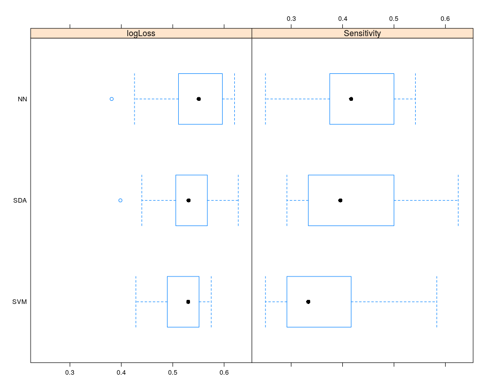

German Credit Data Analysis
================
Varun Khanna
28 January 2019

```r
knitr::opts_chunk$set(fig.width = 10, fig.height = 8, fig.path = 'Figs/', warning = FALSE, message = FALSE)
```

Introduction
------------

When a lending institution like a bank receives a loan application, based on their specific lending criteria, they assess the application and decide whether to approve or deny the loan. Two types of outcomes are associated with the lender’s decision:

-   If the applicant is worthy (have a good credit profile), then not approving the loan will make the lender lose out on the earning opportunity.

-   If the applicant is not worthy (have a bad credit profile), then approving the loan will likely result in financial loss to the lender.

The second outcome is associated with a greater risk as an untrustworthy borrower has a higher chance of default and thus making it harder for lenders to recover even the borrowed amount. Therefore, it is imperative for a lender to evaluate the risks associated with lending the money to a customer.

Aims
----

This is a demonstration in R using the *caret* package to assess the risk of lending the money to the customer by studying the applicant's demographic and social-economic profile. I have compared several supervised machine learning algorithms and maximized the sensitivity of the model to detect borrowers with bad credit profile. In the business parlance, I have tried to minimize the risk and maximize the profit for the lenders as shown in **[cost profit analysis](#cost-and-profit-analysis)**.

Data
====

The German Credit Data is a public data downloaded from \[UCI Machine Learning Repository\](<https://archive.ics.uci.edu/ml/datasets/Statlog+(German+Credit+Data)>. The dataset contains 1000 entries with 20 categorical features prepared by Prof. Hofmann. Each entry represents a customer and is classified as good or bad credit risk, according to the set of features.

Load the data, functions and the libraries
------------------------------------------

```r
library("tidyverse")
library("plotly")
library("knitr")
library("gmodels")
library("caret")
library("ROCR")
library("caretEnsemble")
library("rpart.plot")
library("kableExtra")
```

```r
# This function calculates Confusion matrix (CM). CM is a very useful tool and is called CM because it reveals how confused your model is betrween two classes 
cm <- function(model, data){
confusionMatrix(predict(model, newdata = data), data$credit_rating)
}

# This function identifies and plots the best probability cutoff values by maximizing tpr and fpr values from the ROC plot 
roc_cutoff <- function(model, data, response) {
# Check for the stack models  
if(str_detect(deparse(substitute(model)),'stack')) {
pred <- predict(model, data, type = "prob") %>% data.frame(bad = ., good = 1 -.)
pred <- pred[,1]
}
else{
pred <- predict(model, data, type = 'prob')[,1]
}
# ROCR considers the later level to be the positive class. The logic is that 1 is the positive class and 0 the negative and since 0 < 1 and "bad" < "good", ROCR considers "good" to be the positive class here. therefore label.ordering
pred <- prediction(pred, data[,response], label.ordering = c("good","bad"))
eval <- performance(pred, "tpr","fpr")
plot(eval)

# maximize the TPR and FPR
max <- which.max(slot(eval,"y.values")[[1]] +  1 - slot(eval,"x.values")[[1]])
# get the best cutoff value
cutoff <- slot(eval, "alpha.values")[[1]][max]
tpr <- slot(eval, "y.values")[[1]][max]
fpr <- slot(eval, "x.values")[[1]][max]
abline(h = tpr, v = fpr, lty = 2, col = "blue") # best cutoff
text(0.7,0.2, paste0("At best cutoff = ", round(cutoff,2)), col = "blue")
# Default cutoff
default <- last(which(slot(eval, "alpha.values")[[1]] >= 0.5))
defaulty <- slot(eval,"y.values")[[1]][default]
defaultx <- slot(eval,"x.values")[[1]][default]
abline(h = defaulty, v = defaultx, col = "red", lty = 2) # Default cutoff
text(0.7,0.3, paste0("At default cutoff = ", 0.50), col = "red")
return(cutoff)
}

# This function returns the most common outcome of the ML algos during consensus modeling

chooseMajorityVote <- function(x) {
    tabulatedOutcomes <- table(x)
    sortedOutcomes <- sort(tabulatedOutcomes, decreasing = TRUE)
    mostCommonLabel <- names(sortedOutcomes)[1]
    return(mostCommonLabel)
}
```

```r
data <- read_delim("data/german.data", delim = "\t", col_names = F)

german.colnames <- c("account_status","months","credit_history","purpose",
"credit_amount","savings","employment","installment_rate","personal_status","guarantors","residence","property","age","other_installments","housing","credit_cards","job","dependents","phone","foreign_worker","credit_rating")

colnames(data) <- german.colnames

# Let us look at the first six rows
head(data)
```

    ## # A tibble: 6 x 21
    ##   account_status months credit_history purpose credit_amount savings
    ##   <chr>           <dbl> <chr>          <chr>           <dbl> <chr>  
    ## 1 A11                 6 A34            A43              1169 A65    
    ## 2 A12                48 A32            A43              5951 A61    
    ## 3 A14                12 A34            A46              2096 A61    
    ## 4 A11                42 A32            A42              7882 A61    
    ## 5 A11                24 A33            A40              4870 A61    
    ## 6 A14                36 A32            A46              9055 A65    
    ## # … with 15 more variables: employment <chr>, installment_rate <dbl>,
    ## #   personal_status <chr>, guarantors <chr>, residence <dbl>,
    ## #   property <chr>, age <dbl>, other_installments <chr>, housing <chr>,
    ## #   credit_cards <dbl>, job <chr>, dependents <dbl>, phone <chr>,
    ## #   foreign_worker <chr>, credit_rating <dbl>

```r
# Convert credit rating to categorical factors
data <- data %>% mutate(credit_rating = factor(ifelse(credit_rating == 1, "good","bad"), level = c("bad","good")))
```

Exploratory data analysis
-------------------------

Now that we have loaded the data it is important to understand the data before attempting any modeling.

```r
# look at the structure of the data
glimpse(data)
```

    ## Observations: 1,000
    ## Variables: 21
    ## $ account_status     <chr> "A11", "A12", "A14", "A11", "A11", "A14", "A1…
    ## $ months             <dbl> 6, 48, 12, 42, 24, 36, 24, 36, 12, 30, 12, 48…
    ## $ credit_history     <chr> "A34", "A32", "A34", "A32", "A33", "A32", "A3…
    ## $ purpose            <chr> "A43", "A43", "A46", "A42", "A40", "A46", "A4…
    ## $ credit_amount      <dbl> 1169, 5951, 2096, 7882, 4870, 9055, 2835, 694…
    ## $ savings            <chr> "A65", "A61", "A61", "A61", "A61", "A65", "A6…
    ## $ employment         <chr> "A75", "A73", "A74", "A74", "A73", "A73", "A7…
    ## $ installment_rate   <dbl> 4, 2, 2, 2, 3, 2, 3, 2, 2, 4, 3, 3, 1, 4, 2, …
    ## $ personal_status    <chr> "A93", "A92", "A93", "A93", "A93", "A93", "A9…
    ## $ guarantors         <chr> "A101", "A101", "A101", "A103", "A101", "A101…
    ## $ residence          <dbl> 4, 2, 3, 4, 4, 4, 4, 2, 4, 2, 1, 4, 1, 4, 4, …
    ## $ property           <chr> "A121", "A121", "A121", "A122", "A124", "A124…
    ## $ age                <dbl> 67, 22, 49, 45, 53, 35, 53, 35, 61, 28, 25, 2…
    ## $ other_installments <chr> "A143", "A143", "A143", "A143", "A143", "A143…
    ## $ housing            <chr> "A152", "A152", "A152", "A153", "A153", "A153…
    ## $ credit_cards       <dbl> 2, 1, 1, 1, 2, 1, 1, 1, 1, 2, 1, 1, 1, 2, 1, …
    ## $ job                <chr> "A173", "A173", "A172", "A173", "A173", "A172…
    ## $ dependents         <dbl> 1, 1, 2, 2, 2, 2, 1, 1, 1, 1, 1, 1, 1, 1, 1, …
    ## $ phone              <chr> "A192", "A191", "A191", "A191", "A191", "A192…
    ## $ foreign_worker     <chr> "A201", "A201", "A201", "A201", "A201", "A201…
    ## $ credit_rating      <fct> good, bad, good, good, bad, good, good, good,…

```r
# proportion of people with good and bad credit
prop.table(table(data$credit_rating))
```

    ## 
    ##  bad good 
    ##  0.3  0.7

```r
# calculate the proportion of good and bad credit ratings for all ages
ageCredit <-  as.data.frame((prop.table(table(data$age,data$credit_rating),1)))
names(ageCredit) <- c("age", "credit_rating", "proportion")
# plot the proportion
p1 <- ggplot(ageCredit, aes(x = age, y = proportion, fill = credit_rating)) + geom_bar(stat = "identity", width = 1)  + scale_x_discrete(breaks = seq(19,75,3), labels = seq(19,75,3)) + theme(legend.position = "none")

# Plot overlapping histograms of the age distribution for good and bad credit_ratings
df_good <- data[data$credit_rating == "good","age"]
df_bad = data[data$credit_rating == "bad","age"]

f1 <- list(family = "Arial, sans-serif", size = 18, color = "grey")
xaxis <- list(title = "Age",titlefont = f1)
yaxis <- list(title = "Number of samples",titlefont = f1)

p1 <- plot_ly(alpha = 0.8) %>% add_histogram(x = df_bad$age, name = "bad", color = I('#999999')) %>% add_histogram( x = df_good$age, name = "good", color = I('#E69F00')) %>% layout(barmode = "overlay", xaxis = xaxis, yaxis = yaxis)

subplot(p1,p1, titleX = T)
```


```r
# Look at the descriptive stats for numeric variables like the month, age and credit amount.

amount <- summary(data$credit_amount, digits = 2) 
age <- summary(data$age, digits = 2)
month <- summary(data$months, digits = 2)

continuousVariables <- rbind(amount,age,month)

kable(continuousVariables)
```

<table>
<thead>
<tr>
<th style="text-align:left;">
</th>
<th style="text-align:right;">
Min.
</th>
<th style="text-align:right;">
1st Qu.
</th>
<th style="text-align:right;">
Median
</th>
<th style="text-align:right;">
Mean
</th>
<th style="text-align:right;">
3rd Qu.
</th>
<th style="text-align:right;">
Max.
</th>
</tr>
</thead>
<tbody>
<tr>
<td style="text-align:left;">
amount
</td>
<td style="text-align:right;">
250
</td>
<td style="text-align:right;">
1400
</td>
<td style="text-align:right;">
2300
</td>
<td style="text-align:right;">
3300
</td>
<td style="text-align:right;">
4000
</td>
<td style="text-align:right;">
18000
</td>
</tr>
<tr>
<td style="text-align:left;">
age
</td>
<td style="text-align:right;">
19
</td>
<td style="text-align:right;">
27
</td>
<td style="text-align:right;">
33
</td>
<td style="text-align:right;">
36
</td>
<td style="text-align:right;">
42
</td>
<td style="text-align:right;">
75
</td>
</tr>
<tr>
<td style="text-align:left;">
month
</td>
<td style="text-align:right;">
4
</td>
<td style="text-align:right;">
12
</td>
<td style="text-align:right;">
18
</td>
<td style="text-align:right;">
21
</td>
<td style="text-align:right;">
24
</td>
<td style="text-align:right;">
72
</td>
</tr>
</tbody>
</table>

```r
# Plot numeric variables individually

par(mfrow = c(1,3))
# Frequency distribution of the credit amount
brk <- 30
hist(data$credit_amount, breaks = brk, main = "Distribution of the credit amount", xlab = "Amount", col = "skyblue", panel.first = grid())

# Age distribution of debtors 
hist(data$age, breaks = brk, main = "Distribution of the age", xlab = "Age", col = "darkmagenta", panel.first = grid())

# Duration of the loan 
hist(data$months, breaks = brk, main = "Distribution of the duration of the months", xlab = "Months", col = "darkgreen", panel.first = grid())
```


The plots above show that most of the loan seekers are between 20 and 40 years of age and the amount of the loan sought is usually below 5000 euros. Furthermore, the majority of the loans are between 4 and 30 months. Note that all three variables show marked positive skewness.

### Cross-tabulation and Chi-squared values

The $\\chi^2 = \\sum \\frac {(O - E)^2}{E}$ statistics is used to determine whether an observed number differs either by chance from what was expected or something else. It is most often used to analyze data that consist of count or frequencies. The *χ*<sup>2</sup> test is used in two similar but distinct circumstances:

-   **Good of fit test** for estimating how closely an observed distribution matches an expected distribution.

-   **Chi-square test of Independence** for estimating whether there is an association between two random variables. *i.e* are they independent.

We are going to use the Chi-square test of Independence below:

```r
# credit_rating vs account_status
with(data, CrossTable(credit_rating, account_status, digits = 1, prop.chisq = F, chisq = T))
```

    ## 
    ##  
    ##    Cell Contents
    ## |-------------------------|
    ## |                       N |
    ## |           N / Row Total |
    ## |           N / Col Total |
    ## |         N / Table Total |
    ## |-------------------------|
    ## 
    ##  
    ## Total Observations in Table:  1000 
    ## 
    ##  
    ##               | account_status 
    ## credit_rating |       A11 |       A12 |       A13 |       A14 | Row Total | 
    ## --------------|-----------|-----------|-----------|-----------|-----------|
    ##           bad |       135 |       105 |        14 |        46 |       300 | 
    ##               |       0.5 |       0.3 |       0.0 |       0.2 |       0.3 | 
    ##               |       0.5 |       0.4 |       0.2 |       0.1 |           | 
    ##               |       0.1 |       0.1 |       0.0 |       0.0 |           | 
    ## --------------|-----------|-----------|-----------|-----------|-----------|
    ##          good |       139 |       164 |        49 |       348 |       700 | 
    ##               |       0.2 |       0.2 |       0.1 |       0.5 |       0.7 | 
    ##               |       0.5 |       0.6 |       0.8 |       0.9 |           | 
    ##               |       0.1 |       0.2 |       0.0 |       0.3 |           | 
    ## --------------|-----------|-----------|-----------|-----------|-----------|
    ##  Column Total |       274 |       269 |        63 |       394 |      1000 | 
    ##               |       0.3 |       0.3 |       0.1 |       0.4 |           | 
    ## --------------|-----------|-----------|-----------|-----------|-----------|
    ## 
    ##  
    ## Statistics for All Table Factors
    ## 
    ## 
    ## Pearson's Chi-squared test 
    ## ------------------------------------------------------------
    ## Chi^2 =  123.7209     d.f. =  3     p =  1.218902e-26 
    ## 
    ## 
    ## 

```r
# credit_rating vs savings
with(data, CrossTable(credit_rating, savings, digits = 1, prop.chisq = F, chisq = T))
```

    ## 
    ##  
    ##    Cell Contents
    ## |-------------------------|
    ## |                       N |
    ## |           N / Row Total |
    ## |           N / Col Total |
    ## |         N / Table Total |
    ## |-------------------------|
    ## 
    ##  
    ## Total Observations in Table:  1000 
    ## 
    ##  
    ##               | savings 
    ## credit_rating |       A61 |       A62 |       A63 |       A64 |       A65 | Row Total | 
    ## --------------|-----------|-----------|-----------|-----------|-----------|-----------|
    ##           bad |       217 |        34 |        11 |         6 |        32 |       300 | 
    ##               |       0.7 |       0.1 |       0.0 |       0.0 |       0.1 |       0.3 | 
    ##               |       0.4 |       0.3 |       0.2 |       0.1 |       0.2 |           | 
    ##               |       0.2 |       0.0 |       0.0 |       0.0 |       0.0 |           | 
    ## --------------|-----------|-----------|-----------|-----------|-----------|-----------|
    ##          good |       386 |        69 |        52 |        42 |       151 |       700 | 
    ##               |       0.6 |       0.1 |       0.1 |       0.1 |       0.2 |       0.7 | 
    ##               |       0.6 |       0.7 |       0.8 |       0.9 |       0.8 |           | 
    ##               |       0.4 |       0.1 |       0.1 |       0.0 |       0.2 |           | 
    ## --------------|-----------|-----------|-----------|-----------|-----------|-----------|
    ##  Column Total |       603 |       103 |        63 |        48 |       183 |      1000 | 
    ##               |       0.6 |       0.1 |       0.1 |       0.0 |       0.2 |           | 
    ## --------------|-----------|-----------|-----------|-----------|-----------|-----------|
    ## 
    ##  
    ## Statistics for All Table Factors
    ## 
    ## 
    ## Pearson's Chi-squared test 
    ## ------------------------------------------------------------
    ## Chi^2 =  36.09893     d.f. =  4     p =  2.761214e-07 
    ## 
    ## 
    ## 

```r
# credit_rating vs personal_status
with(data, CrossTable(credit_rating, personal_status, digits = 1, prop.chisq = F, chisq = T))
```

    ## 
    ##  
    ##    Cell Contents
    ## |-------------------------|
    ## |                       N |
    ## |           N / Row Total |
    ## |           N / Col Total |
    ## |         N / Table Total |
    ## |-------------------------|
    ## 
    ##  
    ## Total Observations in Table:  1000 
    ## 
    ##  
    ##               | personal_status 
    ## credit_rating |       A91 |       A92 |       A93 |       A94 | Row Total | 
    ## --------------|-----------|-----------|-----------|-----------|-----------|
    ##           bad |        20 |       109 |       146 |        25 |       300 | 
    ##               |       0.1 |       0.4 |       0.5 |       0.1 |       0.3 | 
    ##               |       0.4 |       0.4 |       0.3 |       0.3 |           | 
    ##               |       0.0 |       0.1 |       0.1 |       0.0 |           | 
    ## --------------|-----------|-----------|-----------|-----------|-----------|
    ##          good |        30 |       201 |       402 |        67 |       700 | 
    ##               |       0.0 |       0.3 |       0.6 |       0.1 |       0.7 | 
    ##               |       0.6 |       0.6 |       0.7 |       0.7 |           | 
    ##               |       0.0 |       0.2 |       0.4 |       0.1 |           | 
    ## --------------|-----------|-----------|-----------|-----------|-----------|
    ##  Column Total |        50 |       310 |       548 |        92 |      1000 | 
    ##               |       0.1 |       0.3 |       0.5 |       0.1 |           | 
    ## --------------|-----------|-----------|-----------|-----------|-----------|
    ## 
    ##  
    ## Statistics for All Table Factors
    ## 
    ## 
    ## Pearson's Chi-squared test 
    ## ------------------------------------------------------------
    ## Chi^2 =  9.605214     d.f. =  3     p =  0.02223801 
    ## 
    ## 
    ## 

```r
# credit_rating vs dependents
with(data,CrossTable(credit_rating,dependents, digits=1, prop.r=F, prop.t=F, prop.chisq=F, chisq=T))
```

    ## 
    ##  
    ##    Cell Contents
    ## |-------------------------|
    ## |                       N |
    ## |           N / Col Total |
    ## |-------------------------|
    ## 
    ##  
    ## Total Observations in Table:  1000 
    ## 
    ##  
    ##               | dependents 
    ## credit_rating |         1 |         2 | Row Total | 
    ## --------------|-----------|-----------|-----------|
    ##           bad |       254 |        46 |       300 | 
    ##               |       0.3 |       0.3 |           | 
    ## --------------|-----------|-----------|-----------|
    ##          good |       591 |       109 |       700 | 
    ##               |       0.7 |       0.7 |           | 
    ## --------------|-----------|-----------|-----------|
    ##  Column Total |       845 |       155 |      1000 | 
    ##               |       0.8 |       0.2 |           | 
    ## --------------|-----------|-----------|-----------|
    ## 
    ##  
    ## Statistics for All Table Factors
    ## 
    ## 
    ## Pearson's Chi-squared test 
    ## ------------------------------------------------------------
    ## Chi^2 =  0.009089339     d.f. =  1     p =  0.9240463 
    ## 
    ## Pearson's Chi-squared test with Yates' continuity correction 
    ## ------------------------------------------------------------
    ## Chi^2 =  0     d.f. =  1     p =  1 
    ## 
    ## 

```r
# credit_rating vs job 
with(data, CrossTable(credit_rating, job, digits = 1, prop.chisq = F, chisq = T))
```

    ## 
    ##  
    ##    Cell Contents
    ## |-------------------------|
    ## |                       N |
    ## |           N / Row Total |
    ## |           N / Col Total |
    ## |         N / Table Total |
    ## |-------------------------|
    ## 
    ##  
    ## Total Observations in Table:  1000 
    ## 
    ##  
    ##               | job 
    ## credit_rating |      A171 |      A172 |      A173 |      A174 | Row Total | 
    ## --------------|-----------|-----------|-----------|-----------|-----------|
    ##           bad |         7 |        56 |       186 |        51 |       300 | 
    ##               |       0.0 |       0.2 |       0.6 |       0.2 |       0.3 | 
    ##               |       0.3 |       0.3 |       0.3 |       0.3 |           | 
    ##               |       0.0 |       0.1 |       0.2 |       0.1 |           | 
    ## --------------|-----------|-----------|-----------|-----------|-----------|
    ##          good |        15 |       144 |       444 |        97 |       700 | 
    ##               |       0.0 |       0.2 |       0.6 |       0.1 |       0.7 | 
    ##               |       0.7 |       0.7 |       0.7 |       0.7 |           | 
    ##               |       0.0 |       0.1 |       0.4 |       0.1 |           | 
    ## --------------|-----------|-----------|-----------|-----------|-----------|
    ##  Column Total |        22 |       200 |       630 |       148 |      1000 | 
    ##               |       0.0 |       0.2 |       0.6 |       0.1 |           | 
    ## --------------|-----------|-----------|-----------|-----------|-----------|
    ## 
    ##  
    ## Statistics for All Table Factors
    ## 
    ## 
    ## Pearson's Chi-squared test 
    ## ------------------------------------------------------------
    ## Chi^2 =  1.885156     d.f. =  3     p =  0.5965816 
    ## 
    ## 
    ## 

```r
# credit_rating vs phone
with(data, CrossTable(credit_rating, phone, digits = 1, prop.chisq = F, chisq = T))
```

    ## 
    ##  
    ##    Cell Contents
    ## |-------------------------|
    ## |                       N |
    ## |           N / Row Total |
    ## |           N / Col Total |
    ## |         N / Table Total |
    ## |-------------------------|
    ## 
    ##  
    ## Total Observations in Table:  1000 
    ## 
    ##  
    ##               | phone 
    ## credit_rating |      A191 |      A192 | Row Total | 
    ## --------------|-----------|-----------|-----------|
    ##           bad |       187 |       113 |       300 | 
    ##               |       0.6 |       0.4 |       0.3 | 
    ##               |       0.3 |       0.3 |           | 
    ##               |       0.2 |       0.1 |           | 
    ## --------------|-----------|-----------|-----------|
    ##          good |       409 |       291 |       700 | 
    ##               |       0.6 |       0.4 |       0.7 | 
    ##               |       0.7 |       0.7 |           | 
    ##               |       0.4 |       0.3 |           | 
    ## --------------|-----------|-----------|-----------|
    ##  Column Total |       596 |       404 |      1000 | 
    ##               |       0.6 |       0.4 |           | 
    ## --------------|-----------|-----------|-----------|
    ## 
    ##  
    ## Statistics for All Table Factors
    ## 
    ## 
    ## Pearson's Chi-squared test 
    ## ------------------------------------------------------------
    ## Chi^2 =  1.329783     d.f. =  1     p =  0.2488438 
    ## 
    ## Pearson's Chi-squared test with Yates' continuity correction 
    ## ------------------------------------------------------------
    ## Chi^2 =  1.172559     d.f. =  1     p =  0.2788762 
    ## 
    ## 

This analysis reveals that **account status, savings and personal status (married/single)** influence the credit rating (the chi-squared). On the other hand variables like the **number of dependents, job type and owning a phone connection** does not impact credit rating. Perhaps it is fair to say that people with good credit continue to maintain the status irrespective of the number of dependents to care for and whether they are employed or unemployed.

### Plot the relationship between age, credit\_amount, and purpose

```r
ggplot(data, aes(x = age, y = credit_amount, fill = credit_rating)) + geom_bar(stat = "identity") + facet_wrap(~ purpose) 
```


It is interesting to note that most of the loans are sought for:

-   A40: car (new)
-   A41: car (used)
-   A42: furniture/equipment
-   A43: radio/television
-   A49: business

The plot also reveals that cases of default on the loan amount for the purpose of buying used cars are less than in the cases of buying new cars. Also, lower the age of the debtor higher the risk of recovering the loan amount (hence the bad credit).

### Plot the relationship between age, credit\_amount, and personal\_status

```r
ggplot(data, aes(x = age, y = credit_amount, fill = credit_rating)) + geom_bar(stat = "identity") + facet_wrap(~ personal_status) 
```


The obvious observation from this plot is the absence of data on single women. We cannot say for sure if the data is missing or single women are not applying for the loan. It is also surprising to note that married males (A94) borrow far less than single males (A93). Further, single males (A93) apply for more loan than divorced or married females. As before, young age and high loan amount correspond to bad credit rating.

### Let us remove less important variables, make new ones and do one-hot encoding

```r
# Remove less important features based on the Chi-square analysis done before
 
remove <- c("dependents","job","phone")
data <- select(data, -remove)
```

Models
------

The idea is to compare major classification methods using the caret wrapper library. For the list on available model available in caret please see [caret manual](https://topepo.github.io/caret/available-models.html).

Let us first set up parallel processing

```r
library(doParallel)
x <- detectCores()
cl <- makeCluster(x)
registerDoParallel(cl)
print(paste0("Number of registered cores is ",x))
```

    ## [1] "Number of registered cores is 8"

Split and train
---------------

Use *caret package* to split the data into training and test set with an 80/20 split. We will use repeated cross-validation with 10 folds and 5 repeats for comparing models. The evaluation metric used will be logLoss, accuracy and kappa. The algorithms used for evaluation include:

```r
# Define the metric to be used for evaluation
metric <- "logLoss" # can also be "accuracy", "ROC", "Kappa", "Balanced_Accuracy"

set.seed(77984)
# Split the data into 80/20 split
trainIndex <- createDataPartition(data$credit_rating, p = 0.8, list = F)
train <- data[trainIndex, ]
test <- data[-trainIndex, ]

# Training control parameters
ctrl <- trainControl(method = "cv", number = 10, savePredictions = TRUE, classProbs = TRUE, summaryFunction = multiClassSummary)
```

Try various models
------------------

### 1. Classification and Regression Tree (CART)

The Decision Trees (DT) or Classification and Regression Tree (CART) is a popular ML technique and is used for both classification and regression problems. The *recursive algorithm* works by repeatedly partitioning the data into multiple subspaces such that the group within the subspace is as homogenous as possible. The DT generated by the CART model is generally visualized as a binary tree. The tree grows from the top (root), and at each node, the algorithm decides the best split cutoff that results in greatest purity. The tree will stop growing if (Zhang 2016):

1.  All leaf nodes are pure i.e contains examples of the single class.
2.  A pre-specified minimum number of training observations that cannot be assigned to each leaf nodes with any splitting methods.
3.  The number of observations in the leaf node reaches the pre-specified minimum one.

**Choosing the split point in trees**

For regression trees, the split cutoff is defined so that the residual sum of the squared (RSS) error is minimized across the training examples that fall within a subpartition. *R**S**S* = *s**u**m*((*O**b**s**e**r**v**e**d* − *P**r**e**d**i**c**t**e**d*)<sup>2</sup>). In the classification model, the split point is defined as based on purity and the two measures of purity generally used are *Gini Index* and *entropy*. For a given subpartition, *G**i**n**i* = *s**u**m*(*p*(1 − *p*)) and *e**n**t**r**o**p**y* = −1 \* *s**u**m*(*p* \* *l**o**g*(*p*)), where p is the proportion of misclassified observations within the subpartition. The Gini index and the entropy range from 0 (greatest purity) to 1 (maximum degree of impurity).

**Pruning the tree**

Generally, fully grown trees tend to model the noise in the data and might lead to poor predictive performance on the unseen data. A common strategy employed to limit the overfitting is to prune back the tree resulting in a simpler tree with fewer splits and better interpretation at the cost of a little bias (James et al. 2014, P. Bruce and Bruce (2017)). The idea is to search for a smaller subtree that can give us comparable results to the fully grown tree. One robust strategy of pruning the tree is to stop growing the tree if the split does not significantly improve the overall quality of the model. In *rpart* package, this is controlled by *complexity parameter (cp)* which imposes a penalty to the tree for too many splits. The higher the *cp* smaller the tree.

There are many **advantages of DT**.

-   Simple and easy to understand, interpret and visualize.
-   Help in variable screening or feature selection.
-   Can handle both numerical and categorical data.
-   Requires little effort in data preparation.
-   Can model the nonlinear relationships between the features.

The **disadvantges of DT** include:

-   Overfitting of the data. DT has the tendency to build complex models which do not generalize the data well. Pruning is useful in this case.
-   Given some training examples, there can be many DT that fit the training examples so which decision tree should be generated is a big question? One proposal is to search the space of DTs and prefer the smallest tree that fits the data.
-   A single tree is unstable (high variance) and splits might differ by even the smallest of changes in the training data.

```r
# CART
set.seed(1)
model_cart <- train(credit_rating ~., data = train, method = "rpart", trControl = ctrl, preProcess = c("nzv", "BoxCox"), metric = metric, tuneLength = 10)

# Draw the tree model
rpart.plot(model_cart$finalModel,box.palette = "RdBu",shadow.col = "gray",nn = TRUE)
```


```r
print(model_cart$bestTune)
```

    ##      cp
    ## 8 0.025

### 2. Random Forest (RF)

Random Forest (RF) is one of the most popular and powerful **Ensemble approach** for classification and regression tasks. Sometimes it is not sufficient to rely on one ML model to produce reliable results. Ensemble learning combines multiple models to generate a consensus output from several methods. The models that make up the ensemble also called as base learners, could either be the same learning algorithm or different learning techniques. **Bagging (Bootstrap aggregation) and Boosting** are two widely used methods for ensemble learners.

RF creates a forest of a number of different DT sampling various features (this is called an ) and in general more trees in the forest more robust the model which results in higher accuracy. The main idea behind the ensemble approach is that a group of weak learners can come together to form a strong learner. Data is sampled with replacement ( **bagging** ) and fed into these learners for training. To classify a new object based on its features each tree votes for a class. For classification the algorithm chooses the final label having the most votes over all the other trees in the forest while in regression it takes the average of the output by different trees. Thus ensemble methods reduce the variance and increase the performance.

**Advantages of RF**

-   Can be used for both classification and regression task
-   Can handle missing values
-   Does not overfit the model
-   Can handle data with higher dimensionality

**Disadvantages of RF**

-   Good for classification but not as good as for regression.
-   Seems like a black box approach as a user does not have much control on how the model is built.

```r
# Random forest
set.seed(1)
model_rf <- train(credit_rating ~., data = train, method = "rf", trControl = ctrl, preProcess = c("nzv", "BoxCox"), metric = metric, tuneLength = 10)

print(model_rf$bestTune)
```

    ##   mtry
    ## 4   15

### 3. Linear Discriminant Analysis (LDA)

Ronald Fisher described Linear Discriminant Analysis (LDA) or Fisher Linear Discriminant Analysis in 1936 for a two class problem later it generalized as a multiclass LDA or Multiple Discriminant Analysis by C.R Rao 1948. Along with Principal Component Analysis (PCA), it is one of the most commonly used techniques for dimensionality reduction as a preprocessing step in machine learning applications. The aim is to project the dataset into lower dimension space with a good separability in order to avoid overfitting due to a large number of features and also to reduce computational cost.

**PCA Vs LDA**

Both are dimension reduction techniques which are used for dimensionality reduction. However, there are some key differences

1.  PCA is an unsupervised technique while LDA is a supervised algorithm.
2.  PCA finds the most accurate representation for data in low dimension space by projecting the data in direction of maximum variance. However, the direction of maximum variance may not be useful for classification. LDA on the other hand projects to the direction that maximizes class separation (by maximizing the mean between two categories while minimizing the scatter).

**Disadvantages of LDA**

1.  Small Sample Size (SSS). It occurs when the sample size is much smaller than the number of features. This can be possibly solved with Regularization (RLDA).

2.  If the classes are non linearly separable then LDA cannot be used.

```r
# LDA 
set.seed(1)
model_lda <- train(credit_rating ~., data = train, method = "lda", trControl = ctrl, preProcess = c("nzv", "center","scale","BoxCox"), metric = metric)

# print(model_lda$bestTune)
```

### 4. Shrinkage Discriminant analysis (SDA)

```r
# SDA 
set.seed(1)
model_sda <- train(credit_rating ~., data = train, method = "sda", trControl = ctrl, preProcess = c("nzv", "center","scale","BoxCox"), metric = metric, tuneLength = 10)
```

    ## Number of variables: 35 
    ## Number of observations: 800 
    ## Number of classes: 2 
    ## 
    ## Estimating optimal shrinkage intensity lambda.freq (frequencies): 0.0066 
    ## Estimating variances (pooled across classes)
    ## Estimating optimal shrinkage intensity lambda.var (variance vector): 1 
    ## 
    ## 
    ## Computing inverse correlation matrix (pooled across classes)
    ## Specified shrinkage intensity lambda (correlation matrix): 0.1111

```r
print(model_sda$bestTune)
```

    ##   diagonal    lambda
    ## 2    FALSE 0.1111111

### 5. Support Vector Machine (SVM)

Support vector machine (SVM) is one of the most effective classifiers. SVM is formally defined by an optimal separating hyperplane such that it maximizes the margin between support vectors of either class. The parameter *C* allow the user to dictate the tradeoff between having a wide margin and correctly classifying training data. A higher value of *C* implies fewer errors on the training data however this comes at an expense of wide margin. In case of non linearly separable data, the data is projected into space where it is linearly separable using a kernel function and finds a hyperplane in this space. There are different kernel functions that can be used with SVM such as radial basis, hyperbolic, linear and polynomial.

**Advantages of SVM**

1.  The risk of overfitting is less in SVM.
2.  It works well for high dimensional data.
3.  Unlike NN, SVM is not solved for local minima.
4.  With the appropriate kernel, it is possible to solve any complex problem.
5.  Works well with even unstructured and semi-structured data like text, images, and trees.

**Disadvantages of SVM**

1.  Choosing a good kernel function is not easy.
2.  Takes a long time to train for large datasets.
3.  Difficult to understand and interpret the final model.

```r
# SVM 
set.seed(1)
model_svm <- train(credit_rating ~., data = train, method = "svmRadial", trControl = ctrl, preProcess = c("nzv", "center","scale","BoxCox"), metric = metric, tuneLength = 10)

print(model_svm$bestTune)
```

    ##        sigma C
    ## 3 0.01740105 1

### 6. k-Nearest neighbours (kNN)

It is one of the most fundamental and simplest supervised ML algorithms and is mostly used for classification. It classifies a data point based on how its neighbours are classified. *k* in **kNN** is a parameter that accounts for the number of nearest neighbours to include in the majority voting process. Choosing the right value of *k* is a process called parameter tuning and is important for better accuracy. Most common ways to choose the value of *k* are:

1.  Sqrt(n), where n = total number of observations
2.  Odd value of *k* is selected to avoid confusion between two classes of data.

**Advantages of kNN**

1.  Works well with small and clean data.
2.  Easy to interpret.

**Disadvantages of kNN**

1.  Does not learn a discriminative function from the training set.
2.  Does not work if the data is noisy.

```r
# kNN
set.seed(1)
model_knn <- train(credit_rating ~., data = train, method = "knn", trControl = ctrl, preProcess = c("nzv", "center","scale","BoxCox"), metric = metric, tuneLength = 10)

print(model_knn$bestTune) # Did not perform very well so not included in further analysis
```

    ##     k
    ## 10 23

### 7. Neural Net (NN)

Neural networks are algorithms inspired by biological neural networks. They progressively improve performance to do tasks by considering examples, generally without task-specific programming.

```r
# NN
set.seed(1)
model_nnet <- train(credit_rating ~. , data = train, method = "nnet", trControl = ctrl, preProcess = c("nzv", "center","scale","BoxCox"), metric = metric, tuneLength = 10) 
```

    ## # weights:  38
    ## initial  value 682.913471 
    ## iter  10 value 414.034319
    ## iter  20 value 391.784471
    ## iter  30 value 385.743580
    ## iter  40 value 383.318352
    ## iter  50 value 382.463740
    ## iter  60 value 382.367471
    ## final  value 382.367325 
    ## converged

```r
print(model_nnet$bestTune)
```

    ##    size decay
    ## 10    1   0.1

### 8. Gradient Boosting Machine (GBM)

Most Kaggale winners use some kind of ensemble or stack of various models, one particular algorithm that is part of most of the ensembles is a GBM or some kind of variant. It is based on *Boosting ensemble technique*.

> Boosting (Freud and Shapire, 1996) - algorithm fits many weak classifiers to reweighted versions of the training data. Classify final examples by majority voting.

Boosting is an iterative procedure to fit submodels (usually decision trees) to residuals. In boosting, the trees are built sequentially rather than independently such that each subsequent tree aims to reduce the error of the previous tree. Each tree learns from its predecessor and updates the residual errors. Hence the tree that grows next will be better in explaining the data.

**Advantages of GBM**

1.  Powerful and hard to beat.
2.  Highly flexible. It provides several hyperparameters tuning options.
3.  Can handle missing data and no preprocessing is required.

**Disadvantages of GBM**

1.  Prone to overfitting.
2.  Very time consuming and memory intensive.
3.  Less interpretable

```r
# GBM
set.seed(1)
model_gbm <- train(credit_rating ~ ., data = train, method = 'gbm', trControl = ctrl,preProcess = c("nzv", "BoxCox"),metric = metric, tuneLength = 10)
```

    ## Iter   TrainDeviance   ValidDeviance   StepSize   Improve
    ##      1        1.1879            -nan     0.1000    0.0108
    ##      2        1.1600            -nan     0.1000    0.0095
    ##      3        1.1356            -nan     0.1000    0.0083
    ##      4        1.1134            -nan     0.1000    0.0063
    ##      5        1.0937            -nan     0.1000    0.0070
    ##      6        1.0741            -nan     0.1000    0.0043
    ##      7        1.0602            -nan     0.1000    0.0022
    ##      8        1.0444            -nan     0.1000    0.0029
    ##      9        1.0322            -nan     0.1000    0.0039
    ##     10        1.0151            -nan     0.1000    0.0038
    ##     20        0.9367            -nan     0.1000    0.0010
    ##     40        0.8317            -nan     0.1000    0.0003
    ##     50        0.7919            -nan     0.1000   -0.0024

```r
print(model_gbm$bestTune)
```

    ##    n.trees interaction.depth shrinkage n.minobsinnode
    ## 41      50                 5       0.1             10

```r
stopCluster(cl)
```

### 10. eXtreme Gradient Boosting (XGB)

XGBoost is one of the most sought after ensemble learning method.

In boosting we start with a uniform probability distribution on given training instances and adaptively change the distribution of the training data. Initially, each training example has equal weight however, each round of boosting the weight are adjusted to better represent the misclassified examples. **In contrast to bagging ensemble techniques like RF, in which trees are grown to the maximum extent, boosting make trees that are not very deep thus highly interpretable.** Parameters like the number of trees or iterations, rate of learning, and the depth of the tree, could be optimally selected through validation techniques like k-fold cross-validation. Having a very complex model might lead to overfitting. So it is necessary to carefully choose the stopping criteria.

```r
cl <- makeCluster(1)
registerDoParallel(cl)

# XGB
set.seed(1)
model_xgb <- train(credit_rating ~ ., data = train, method = 'xgbTree', trControl = ctrl,preProcess = c("nzv", "BoxCox"),metric = metric, tuneLength = 10)

print(model_xgb$bestTune)
```

    ##      nrounds max_depth eta gamma colsample_bytree min_child_weight
    ## 2071      50         1 0.4     0              0.6                1
    ##      subsample
    ## 2071 0.8888889

```r
stopCluster(cl)
```

Compare the models (Balanced Accuracy, Kappa and logLoss values)
----------------------------------------------------------------

The `summary()` function will create a summary table for all the evaluation metrics comparing each algorithm in rows.

Density plots are a useful way to evaluate the overlap in the estimated behavior of algorithms (used later).

Boxplots are useful ways to visualize the spread of the estimated Accuracy of different methods. Note that the boxes are ordered from lowest to higher mean accuracy.

The `splom` command (used later) creates a scatter plot matrix of all fold-trial results for an algorithm compared to same fold-trial results for all other algorithms. This comes handy when considering whether the predictions from two different algorithms are correlated. If weakly correlated, they are good candidates for being combined in an ensemble prediction.

It is also possible to calculate the significance of the differences between the metric distributions of different ML algorithms using `diff()`. Subsequently, we can summarize the results directly by calling the `summary()` function. A table of pair-wise statistical significance scores is created where the lower diagonal of the table shows p-values for the null hypothesis (distributions are the same), where a smaller value signifies distributions are not the same. The upper diagonal of the table shows the estimated difference between the distributions.

```r
resample_results <- resamples(list(DT = model_cart, RF = model_rf, LDA = model_lda, SVM = model_svm, NN = model_nnet, GBM = model_gbm, SDA = model_sda, XGB = model_xgb))

# Plot and compare the summary of resamples of different models
summary_resamples <- summary(resample_results,metric = c("Kappa","Balanced_Accuracy","logLoss", "Sensitivity"))
par(mfrow = c(2,2))
# Sort based on balanced Accuracy
sorted <- order((t((summary_resamples$statistics$Balanced_Accuracy)[,-7]))[4,])
boxplot(t((summary_resamples$statistics$Balanced_Accuracy)[,-7])[,sorted], col = "steelblue", main = "Balanced Accuracy", las =2)
boxplot(t((summary_resamples$statistics$Kappa)[,-7])[,sorted], col = "steelblue", main = "Kappa", las = 2)
boxplot(t((summary_resamples$statistics$logLoss)[,-7])[,sorted], col = "steelblue", main = "logLoss", las = 2)
boxplot(t((summary_resamples$statistics$Sensitivity)[,-7])[,sorted], col = "steelblue", main = "Sensitivity", las = 2)
```


Grid tune some of the models
----------------------------

```r
x <- detectCores()
cl <- makeCluster(x)
registerDoParallel(cl)
```

### Tune Neural Network model

```r
# ======================= NN model tuning ======================
print(model_nnet$bestTune)
```

    ##    size decay
    ## 10    1   0.1

```r
nnetGrid <-  expand.grid(decay = c(seq(0.2,0.8,0.01)), size = c(seq(0,3,1)))

set.seed(1)
model_nnet <- train(credit_rating ~., data = train, method = "nnet", trControl = ctrl, preProcess = c("nzv", "center","scale","BoxCox"), metric = metric, tuneGrid = nnetGrid)
```

    ## # weights:  75
    ## initial  value 643.908196 
    ## iter  10 value 409.907444
    ## iter  20 value 385.554598
    ## iter  30 value 376.373270
    ## iter  40 value 372.550313
    ## iter  50 value 370.998924
    ## iter  60 value 370.572796
    ## iter  70 value 369.059236
    ## iter  80 value 367.516243
    ## iter  90 value 364.105289
    ## iter 100 value 363.665715
    ## final  value 363.665715 
    ## stopped after 100 iterations

```r
cm_nnet  <- cm(model_nnet, test)

# print(cm_nnet)

# Calculate the probabilites scores
p1 <- predict(model_nnet, newdata = test, type = "prob")


# Draw the ROC plots to compare default cutoff value and best cutoff value

cutoff <- roc_cutoff(model_nnet, test, "credit_rating")
```


```r
pred_nnet <- ifelse(p1[,1] >= cutoff, "bad","good")

print("Optimized cutoff predictions")
```

    ## [1] "Optimized cutoff predictions"

```r
confusionMatrix(factor(pred_nnet, levels = c("bad","good")), test$credit_rating)
```

    ## Confusion Matrix and Statistics
    ## 
    ##           Reference
    ## Prediction bad good
    ##       bad   47   30
    ##       good  13  110
    ##                                           
    ##                Accuracy : 0.785           
    ##                  95% CI : (0.7215, 0.8398)
    ##     No Information Rate : 0.7             
    ##     P-Value [Acc > NIR] : 0.004475        
    ##                                           
    ##                   Kappa : 0.5264          
    ##  Mcnemar's Test P-Value : 0.014688        
    ##                                           
    ##             Sensitivity : 0.7833          
    ##             Specificity : 0.7857          
    ##          Pos Pred Value : 0.6104          
    ##          Neg Pred Value : 0.8943          
    ##              Prevalence : 0.3000          
    ##          Detection Rate : 0.2350          
    ##    Detection Prevalence : 0.3850          
    ##       Balanced Accuracy : 0.7845          
    ##                                           
    ##        'Positive' Class : bad             
    ## 

### Tune Support Vector Machine model

```r
# ======================= SVM Model tuning ======================
set.seed(1)
print(model_svm$bestTune)
```

    ##        sigma C
    ## 3 0.01740105 1

```r
# For a smaller sigma, the decision boundary tends to be strict and sharp, in contrast for larger values, it tends to overfit.
# Small value of C will cause the optimizer to look for a larger-margin separating hyperplane, even if that hyperplane misclassifies more points.

svmGrid <- expand.grid(sigma = c(seq(0.01,0.09,0.01)),
                       C = c(seq(1,4,0.1)))


model_svm <- train(credit_rating ~., data = train, method = "svmRadial", trControl = ctrl, preProcess = c("nzv", "center","scale","BoxCox"), metric = metric, tuneGrid = svmGrid)

#print(model_svm)

cm_svm  <- cm(model_svm, test)

# print(cm_svm)

# Calculate the probabilites scores
p2 <- predict(model_svm, newdata = test, type = "prob")

# Draw the ROC plots to compare default cutoff value and best cutoff value

cutoff <- roc_cutoff(model_svm, test, "credit_rating")
```


``` r
pred_svm <- ifelse(p2[,1] >= cutoff, "bad","good")

print("Optimized cutoff predictions")
```

    ## [1] "Optimized cutoff predictions"

```r
confusionMatrix(factor(pred_svm, levels = c("bad","good")), test$credit_rating)
```

    ## Confusion Matrix and Statistics
    ## 
    ##           Reference
    ## Prediction bad good
    ##       bad   48   30
    ##       good  12  110
    ##                                           
    ##                Accuracy : 0.79            
    ##                  95% CI : (0.7269, 0.8443)
    ##     No Information Rate : 0.7             
    ##     P-Value [Acc > NIR] : 0.002725        
    ##                                           
    ##                   Kappa : 0.5395          
    ##  Mcnemar's Test P-Value : 0.008712        
    ##                                           
    ##             Sensitivity : 0.8000          
    ##             Specificity : 0.7857          
    ##          Pos Pred Value : 0.6154          
    ##          Neg Pred Value : 0.9016          
    ##              Prevalence : 0.3000          
    ##          Detection Rate : 0.2400          
    ##    Detection Prevalence : 0.3900          
    ##       Balanced Accuracy : 0.7929          
    ##                                           
    ##        'Positive' Class : bad             
    ## 

### Tune Shrinkage Discriminant Analysis model

``` r
# ======================= SDA model tuning ======================
set.seed(1)
print(model_sda$bestTune)
```

    ##   diagonal    lambda
    ## 2    FALSE 0.1111111

``` r
sdaGrid <- expand.grid(lambda = seq(0,10,0.1), diagonal = c(FALSE,TRUE))

model_sda <- train(credit_rating ~., data = train, method = "sda", trControl = ctrl, preProcess = c("nzv", "center","scale","BoxCox"), metric = metric, tuneGrid = sdaGrid)
```

    ## Number of variables: 35 
    ## Number of observations: 800 
    ## Number of classes: 2 
    ## 
    ## Estimating optimal shrinkage intensity lambda.freq (frequencies): 0.0066 
    ## Estimating variances (pooled across classes)
    ## Estimating optimal shrinkage intensity lambda.var (variance vector): 1 
    ## 
    ## 
    ## Computing inverse correlation matrix (pooled across classes)
    ## Specified shrinkage intensity lambda (correlation matrix): 0.1

``` r
cm_sda  <- cm(model_sda, test)
```

    ## Prediction uses 35 features.

``` r
#print(cm_sda)

# Calculate the probabilites scores
p3 <- predict(model_sda, newdata = test, type = "prob")
```

    ## Prediction uses 35 features.

``` r
# Draw the ROC plots to compare default cutoff value and best cutoff value

cutoff <- roc_cutoff(model_sda, test, "credit_rating")
```

    ## Prediction uses 35 features.


``` r
pred_sda <- ifelse(p3[,1] >= cutoff, "bad","good")

print("Optimized cutoff predictions")
```

    ## [1] "Optimized cutoff predictions"

``` r
confusionMatrix(factor(pred_sda, levels = c("bad","good")), test$credit_rating)
```

    ## Confusion Matrix and Statistics
    ## 
    ##           Reference
    ## Prediction bad good
    ##       bad   44   23
    ##       good  16  117
    ##                                           
    ##                Accuracy : 0.805           
    ##                  95% CI : (0.7432, 0.8575)
    ##     No Information Rate : 0.7             
    ##     P-Value [Acc > NIR] : 0.0005187       
    ##                                           
    ##                   Kappa : 0.5507          
    ##  Mcnemar's Test P-Value : 0.3366684       
    ##                                           
    ##             Sensitivity : 0.7333          
    ##             Specificity : 0.8357          
    ##          Pos Pred Value : 0.6567          
    ##          Neg Pred Value : 0.8797          
    ##              Prevalence : 0.3000          
    ##          Detection Rate : 0.2200          
    ##    Detection Prevalence : 0.3350          
    ##       Balanced Accuracy : 0.7845          
    ##                                           
    ##        'Positive' Class : bad             
    ## 

``` r
# Stop the cluster
stopCluster(cl)
```

### Let us compare the final tuned models

``` r
resample_results <- resamples(list(NN = model_nnet, SVM = model_svm, SDA = model_sda))

# Print the results
summary(resample_results,metric = c("Kappa","Accuracy"))
```

    ## 
    ## Call:
    ## summary.resamples(object = resample_results, metric =
    ##  c("Kappa", "Accuracy"))
    ## 
    ## Models: NN, SVM, SDA 
    ## Number of resamples: 10 
    ## 
    ## Kappa 
    ##          Min.   1st Qu.    Median      Mean   3rd Qu.      Max. NA's
    ## NN  0.1438356 0.2363886 0.2951669 0.3160800 0.3709936 0.5547945    0
    ## SVM 0.1438356 0.2123288 0.2771465 0.3082455 0.3970236 0.5512821    0
    ## SDA 0.2105263 0.2383117 0.2846284 0.3357526 0.4130397 0.5886076    0
    ## 
    ## Accuracy 
    ##       Min.  1st Qu.  Median    Mean  3rd Qu.   Max. NA's
    ## NN  0.6750 0.703125 0.72500 0.73625 0.750000 0.8375    0
    ## SVM 0.6875 0.712500 0.73125 0.74375 0.771875 0.8250    0
    ## SDA 0.7000 0.712500 0.72500 0.74750 0.781250 0.8375    0

``` r
# Plot Kappa values
densityplot(resample_results , metric = "Kappa" ,auto.key = list(columns = 3))
```


``` r
# plot all (higher is better)
bwplot(resample_results , metric = c("Kappa","Balanced_Accuracy"))
```


``` r
# plot logLoss values boxplots (lower is better)
bwplot(resample_results , metric = c("logLoss","Sensitivity"))
```



``` r
# Find model correlation
mcr <- modelCor(resample_results)
print(mcr)
```

    ##            NN       SVM       SDA
    ## NN  1.0000000 0.7791729 0.7224616
    ## SVM 0.7791729 1.0000000 0.9426356
    ## SDA 0.7224616 0.9426356 1.0000000

``` r
# Create a scatter plot matrix
splom(resample_results)
```


``` r
# Statistical significance test
differnce  <- diff(resample_results)
# summarize the p-values for pair wise comparision
summary(differnce)
```

    ## 
    ## Call:
    ## summary.diff.resamples(object = differnce)
    ## 
    ## p-value adjustment: bonferroni 
    ## Upper diagonal: estimates of the difference
    ## Lower diagonal: p-value for H0: difference = 0
    ## 
    ## Accuracy 
    ##     NN SVM      SDA     
    ## NN     -0.00750 -0.01125
    ## SVM 1           -0.00375
    ## SDA 1  1                
    ## 
    ## AUC 
    ##     NN SVM       SDA      
    ## NN      0.001116 -0.002232
    ## SVM 1            -0.003348
    ## SDA 1  1                  
    ## 
    ## Balanced_Accuracy 
    ##     NN      SVM       SDA      
    ## NN           0.007738 -0.008036
    ## SVM 1.00000           -0.015774
    ## SDA 1.00000 0.01603            
    ## 
    ## Detection_Rate 
    ##     NN        SVM       SDA     
    ## NN             0.01375   0.00000
    ## SVM 0.4856819           -0.01375
    ## SDA 1.0000000 0.0005198         
    ## 
    ## F1 
    ##     NN       SVM       SDA      
    ## NN            0.025602 -0.008231
    ## SVM 1.000000           -0.033834
    ## SDA 1.000000 0.003424           
    ## 
    ## Kappa 
    ##     NN      SVM       SDA      
    ## NN           0.007835 -0.019673
    ## SVM 1.00000           -0.027507
    ## SDA 1.00000 0.07728            
    ## 
    ## logLoss 
    ##     NN     SVM       SDA      
    ## NN          0.020785  0.014883
    ## SVM 0.2931           -0.005902
    ## SDA 0.2667 1.0000             
    ## 
    ## Neg_Pred_Value 
    ##     NN      SVM       SDA      
    ## NN           0.006565 -0.003689
    ## SVM 1.00000           -0.010255
    ## SDA 1.00000 0.00366            
    ## 
    ## Pos_Pred_Value 
    ##     NN     SVM       SDA      
    ## NN         -0.032732 -0.025656
    ## SVM 0.5322            0.007075
    ## SDA 1.0000 1.0000             
    ## 
    ## prAUC 
    ##     NN SVM       SDA      
    ## NN     -0.003396 -0.005572
    ## SVM 1            -0.002176
    ## SDA 1  1                  
    ## 
    ## Precision 
    ##     NN     SVM       SDA      
    ## NN         -0.032732 -0.025656
    ## SVM 0.5322            0.007075
    ## SDA 1.0000 1.0000             
    ## 
    ## Recall 
    ##     NN        SVM       SDA     
    ## NN             0.04583   0.00000
    ## SVM 0.4856819           -0.04583
    ## SDA 1.0000000 0.0005198         
    ## 
    ## Sensitivity 
    ##     NN        SVM       SDA     
    ## NN             0.04583   0.00000
    ## SVM 0.4856819           -0.04583
    ## SDA 1.0000000 0.0005198         
    ## 
    ## Specificity 
    ##     NN      SVM      SDA     
    ## NN          -0.03036 -0.01607
    ## SVM 0.01283           0.01429
    ## SDA 0.44009 0.26053

Consensus model
---------------

Consensus model was created by combining the predictions from individual tuned models and taking the majority vote.

``` r
pred_all <- bind_cols(nnet = pred_nnet, svm = pred_svm, sda = pred_sda)

pred_all$consensus <- apply(pred_all, 1, chooseMajorityVote)

#cm_final <- confusionMatrix(factor(pred_all$consensus, levels = c("bad","good")), test$credit_rating)
#print(cm_final)

# print(pred_all)


print("==============Calculate Probabilities =============")
```

    ## [1] "==============Calculate Probabilities ============="

``` r
# Calculate probabilities of prediction and multiply by the balanced accuracy of each model for weighted predictions.

algos <- names(pred_all)[-length(names(pred_all))]

for (algo in algos)
  {
  #print(algo)
  assign(paste0("sens","_",algo), sensitivity(factor(get(paste0("pred","_",algo)), levels = c("bad","good")), test$credit_rating))
assign(paste0("spec","_",algo), specificity(factor(get(paste0("pred","_",algo)), levels = c("bad","good")), test$credit_rating))
  }

 print("==============balanced accuracy score ========") 
```

    ## [1] "==============balanced accuracy score ========"

``` r
prob_all <- bind_cols(nnet = p1[,1] * (sens_nnet + spec_nnet)/2, svm = p2[,1] * (sens_svm + spec_svm)/2, sda = p3[,1] * (sens_sda + spec_sda)/2) 

 prob_all$final_ba <- rowMeans(prob_all) 

 pred <- prediction(prob_all$final_ba, test[,"credit_rating"], label.ordering = c("good","bad")) 
 eval <- performance(pred, "tpr","fpr") 
 plot(eval) 


 max <- which.max(slot(eval,"y.values")[[1]] +  1 - slot(eval,"x.values")[[1]]) 
 # get the best cutoff value 
 cutoff <- slot(eval, "alpha.values")[[1]][max] 
 tpr <- slot(eval, "y.values")[[1]][max] 
 fpr <- slot(eval, "x.values")[[1]][max] 
 abline(h = tpr, v = fpr, lty = 2, col = "blue") # best cutoff 
 text(0.7,0.2, paste0("At best cutoff = ", round(cutoff,2)), col = "blue") 
 # Default cutoff 
 default <- last(which(slot(eval, "alpha.values")[[1]] >= 0.5)) 
 defaulty <- slot(eval,"y.values")[[1]][default] 
 defaultx <- slot(eval,"x.values")[[1]][default] 
 abline(h = defaulty, v = defaultx, col = "red", lty = 2) # Default cutoff 
 text(0.7,0.3, paste0("At default cutoff = ", 0.50), col = "red") 
```


``` r
 prob_all$labels_ba <- ifelse(prob_all$final_ba >= cutoff, "bad","good") 
 print(prob_all) 
```

    ## # A tibble: 200 x 5
    ##      nnet    svm    sda final_ba labels_ba
    ##     <dbl>  <dbl>  <dbl>    <dbl> <chr>    
    ##  1 0.0727 0.0669 0.0489   0.0628 good     
    ##  2 0.609  0.289  0.409    0.436  bad      
    ##  3 0.306  0.387  0.428    0.374  bad      
    ##  4 0.350  0.362  0.372    0.361  bad      
    ##  5 0.170  0.146  0.137    0.151  good     
    ##  6 0.239  0.194  0.208    0.214  good     
    ##  7 0.216  0.201  0.177    0.198  good     
    ##  8 0.566  0.446  0.512    0.508  bad      
    ##  9 0.0489 0.157  0.0333   0.0798 good     
    ## 10 0.209  0.305  0.244    0.253  good     
    ## # … with 190 more rows

``` r
 cm_final_prob <- confusionMatrix(factor(prob_all$labels_ba, levels = c("bad","good")), test$credit_rating) 
 print(cm_final_prob) 
```

    ## Confusion Matrix and Statistics
    ## 
    ##           Reference
    ## Prediction bad good
    ##       bad   48   25
    ##       good  12  115
    ##                                           
    ##                Accuracy : 0.815           
    ##                  95% CI : (0.7541, 0.8663)
    ##     No Information Rate : 0.7             
    ##     P-Value [Acc > NIR] : 0.0001479       
    ##                                           
    ##                   Kappa : 0.5852          
    ##  Mcnemar's Test P-Value : 0.0485197       
    ##                                           
    ##             Sensitivity : 0.8000          
    ##             Specificity : 0.8214          
    ##          Pos Pred Value : 0.6575          
    ##          Neg Pred Value : 0.9055          
    ##              Prevalence : 0.3000          
    ##          Detection Rate : 0.2400          
    ##    Detection Prevalence : 0.3650          
    ##       Balanced Accuracy : 0.8107          
    ##                                           
    ##        'Positive' Class : bad             
    ## 

Ensemble model
--------------

Lets us build an ensemble models with and 'glm' as a meta-learner and our three tuned models(nn, svm and sda) as base learners. Finally, we can compare the results of ensemble models with individual models and the consensus predictions of individual models.

``` r
 library("doParallel") 
 cl <- makeCluster(2) 
 registerDoParallel(cl) 

 models <- list(nnet = model_nnet, svmRadial = model_svm, sda = model_sda) 


  class(models) <- "caretList" 

 stackControl <- trainControl(method = "repeatedcv", number = 10, repeats = 5, savePredictions = TRUE, classProbs = TRUE, summary = multiClassSummary) 

 stack.glm_customized <- caretStack(models, method = "glm",metric = metric, trControl = stackControl) 

 stack.lda_customized <- caretStack(models, method = "lda",metric = metric, trControl = stackControl) 

 stopCluster(cl) 

 print("=========glm ensemble model========") 
```

    ## [1] "=========glm ensemble model========"

``` r
 p_glm_stack <- predict(stack.glm_customized, newdata = test, type = "prob") %>% data.frame(bad = ., good = 1- .) 
```

    ## Prediction uses 35 features.

``` r
 cutoff <- roc_cutoff(stack.glm_customized, test, "credit_rating") 
```

    ## Prediction uses 35 features.


``` r
 pred_glm_stack <- ifelse(p_glm_stack[,1] >= cutoff, "bad","good") 

 cm_ensemble_glm <- confusionMatrix(factor(pred_glm_stack, levels = c("bad","good")), test$credit_rating) 

 print(cm_ensemble_glm) 
```

    ## Confusion Matrix and Statistics
    ## 
    ##           Reference
    ## Prediction bad good
    ##       bad   50   31
    ##       good  10  109
    ##                                           
    ##                Accuracy : 0.795           
    ##                  95% CI : (0.7323, 0.8487)
    ##     No Information Rate : 0.7             
    ##     P-Value [Acc > NIR] : 0.001613        
    ##                                           
    ##                   Kappa : 0.5563          
    ##  Mcnemar's Test P-Value : 0.001787        
    ##                                           
    ##             Sensitivity : 0.8333          
    ##             Specificity : 0.7786          
    ##          Pos Pred Value : 0.6173          
    ##          Neg Pred Value : 0.9160          
    ##              Prevalence : 0.3000          
    ##          Detection Rate : 0.2500          
    ##    Detection Prevalence : 0.4050          
    ##       Balanced Accuracy : 0.8060          
    ##                                           
    ##        'Positive' Class : bad             
    ## 

Cost and profit analysis
------------------------

All these statistical tests must be translated into profits for the lender. Let us assume that a correct decision by the lender would result in a 30% profit at the end of 5 years. A correct decision here means that the lender predicts an applicant to be good and the applicant actually turns out be creditworthy. Otherwise, if the opposite is true then the lender predicts good but the applicant turns out to be non-creditworthy, it is 100% loss to the lender. Similarly, if the lender predicts an applicant bad but it is actually a creditworthy customer then the lender incurs no loss however, opportunity is lost. The cost matrix is as follows:

### Cost Matrix:

``` r
ref = data.frame(bad = 0, good = -0.30)
pred = data.frame(bad = -1.00 , good = +0.30 )

cm <- rbind(ref,pred)
rownames(cm) <- c("bad","good")
kable(cm) %>% kable_styling("striped", full_width = F) %>%  column_spec(1, bold = T, border_right = T) %>% add_header_above(c("Predicted" = 1, "Reference" = 2)) 
```

<table class="table table-striped" style="width: auto !important; margin-left: auto; margin-right: auto;">
<thead>
<tr>
<th style="border-bottom:hidden; padding-bottom:0; padding-left:3px;padding-right:3px;text-align: center; " colspan="1">
Predicted

</th>
<th style="border-bottom:hidden; padding-bottom:0; padding-left:3px;padding-right:3px;text-align: center; " colspan="2">
Reference

</th>
</tr>
<tr>
<th style="text-align:left;">
</th>
<th style="text-align:right;">
bad
</th>
<th style="text-align:right;">
good
</th>
</tr>
</thead>
<tbody>
<tr>
<td style="text-align:left;font-weight: bold;border-right:1px solid;">
bad
</td>
<td style="text-align:right;">
0
</td>
<td style="text-align:right;">
-0.3
</td>
</tr>
<tr>
<td style="text-align:left;font-weight: bold;border-right:1px solid;">
good
</td>
<td style="text-align:right;">
-1
</td>
<td style="text-align:right;">
0.3
</td>
</tr>
</tbody>
</table>

According to the data out of 1000 applicant 700 are good (creditworthy). A lender without any model would incur \[0.7 \* 0.3 + 0.3 \* ( − 1.0)\] = −0.07 or **0.07 unit loss**. If the median loan amount is 2900 DM, then the **total loss will be 203000 DM and per applicant, the loss will be 203 DM.**

However, from the best model a lender will have the following changes:

```r
kable(as.matrix(cm_final_prob)) %>% kable_styling("striped", full_width = F) %>%  column_spec(1, bold = T, border_right = T)
```

<table class="table table-striped" style="width: auto !important; margin-left: auto; margin-right: auto;">
<thead>
<tr>
<th style="text-align:left;">
</th>
<th style="text-align:right;">
bad
</th>
<th style="text-align:right;">
good
</th>
</tr>
</thead>
<tbody>
<tr>
<td style="text-align:left;font-weight: bold;border-right:1px solid;">
bad
</td>
<td style="text-align:right;">
48
</td>
<td style="text-align:right;">
25
</td>
</tr>
<tr>
<td style="text-align:left;font-weight: bold;border-right:1px solid;">
good
</td>
<td style="text-align:right;">
12
</td>
<td style="text-align:right;">
115
</td>
</tr>
</tbody>
</table>

57.5% (115/200) of the customers will be correctly classified as good. 12.5% (25/200) of customers will be classified as of bad credit profile when they have good credit history while only 6% (12/200) of the customers will be wrongly classified having good credit profile when they are not creditworthy.

therefore, the lender will have \[0.575 \* 0.3 + 0.125 \* ( − 0.3)+0.06 \* ( − 1)\] = +0.075 or **0.075 unit profit**. With the median amount 2900 DM, the **total profit will be 217500 DM and per applicant profit will be 217.5.**

Conclusions
-----------

In this report, we compared 10 different popular classification techniques using the caret package in R to identify potential defaulters based on the well-known German credit dataset. Once potential defaulters are identified, proactive approaches can be developed to minimize the risk to the lender. Following were the conclusions from the analysis:

1.  The results show that the good classification model to predict credit risk based on German credit data can be obtained by a variety of methods. Simple models like *sda* give an equivalent perfromance as compared to more complex models like *xgb* or *svm*.

2.  Right cutoff value almost always boosts model performance as compared to the default value.

3.  Simply by combining top performing models and creating a combined prediction can increase prediction accuracy and make the predictions more robust.

4.  Caret package in R provides a useful and convenient interface for creating ensemble models. Ensemble models also can increase the accuracy of prediction although, further tuning of ensemble models is possible to obtain even higher accuracy.

References
----------

Zhang, Zhongheng. 2016. “Decision Tree Modeling Using R.” Annals of Translational Medicine 4 (15).

Bruce, Peter, and Andrew Bruce. 2017. Practical Statistics for Data Scientists. O’Reilly Media.

James, Gareth, Daniela Witten, Trevor Hastie, and Robert Tibshirani. 2014. An Introduction to Statistical Learning: With Applications in R. Springer Publishing Company, Incorporated.

Kuhn, M., The caret package, Retrieved from <http://topepo.github.io/caret/index.html>
